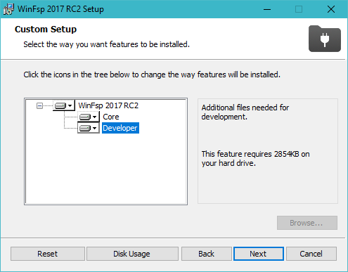

<h1 align="center">WinFsp &middot; Windows File System Proxy</h1>

<p align="center">
    
    <br/>
    <br/>
    <i>WinFsp enables developers to write their own file systems (i.e. "Windows drives") as user mode programs and without any knowledge of Windows kernel programming. It is similar to FUSE (Filesystem in Userspace) for Linux and other UNIX-like computers.</i>
    <br/>
    <br/>
    <a href="https://winfsp.dev"><b>winfsp.dev</b></a>
    <br/>
    <br/>
    <a href="https://github.com/winfsp/winfsp/releases/latest"></a>
    <a href="https://github.com/winfsp/winfsp/releases"></a>
    <a href="https://chocolatey.org/packages/winfsp"></a>
    <br/>
    <br/>
    
    <br/>
    <br/>
</p>

<hr/>

## Overview

WinFsp is a platform that provides development and runtime support for custom file systems on Windows computers. Typically any information or storage may be organized and presented as a file system via WinFsp, with the benefit being that the information can be accessed via the standand Windows file API’s by any Windows application.

The core WinFsp consists of a kernel mode file system driver (FSD) and a user mode DLL. The FSD interfaces with the Windows kernel and handles all interactions necessary to present itself as a file system driver. The DLL interfaces with the FSD and presents an API that can be used to handle file system functions. For example, when an application attempts to open a file, the file system receives an `Open` call with the necessary information.

Using WinFsp to build a file system has many benefits:

**Easy development**: Developing kernel mode file systems for Windows is a notoriously difficult task. WinFsp makes file system development relatively painless. This [Tutorial](doc/WinFsp-Tutorial.asciidoc) explains how to build a file system.

**Stability**: Stable software without any known kernel mode crashes, resource leaks or similar problems. WinFsp owes this stability to its [Design](doc/WinFsp-Design.asciidoc) and its rigorous [Testing Regime](doc/WinFsp-Testing.asciidoc).

**Correctness**: Strives for file system correctness and compatibility with NTFS. For details see the [Compatibility](doc/NTFS-Compatibility.asciidoc) document.

**Performance**: Has excellent performance that rivals or exceeds that of NTFS in many file system scenarios. Read more about its [Performance](doc/WinFsp-Performance-Testing.asciidoc).

<p align="center">
    
    
</p>

**Wide support**: Supports Windows 7 to Windows 11 and the x86, x64 and ARM64 architectures.

**Flexible API**: Includes Native, FUSE2, FUSE3 and .NET API's.

**Shell integration**: Provides facilities to integrate user mode file systems with the Windows shell. See the [Service Architecture](doc/WinFsp-Service-Architecture.asciidoc) document.

**Self-contained**: Self-contained software without external dependencies.

**Widely used**: Used in many open-source and commercial applications with millions of installations (estimated: the WinFsp project does not track its users).

**Flexible licensing**: Available under the [GPLv3](License.txt) license with a special exception for Free/Libre and Open Source Software. A commercial license is also available. Please contact Bill Zissimopoulos \<billziss at navimatics.com> for more details.

## Installation

Download and run the [WinFsp installer](https://github.com/winfsp/winfsp/releases/latest). In the installer select the option to install the "Developer" files. These include the MEMFS sample file system, but also header and library files that let you develop your own user-mode file system.



### Launch a file system for testing

You can test WinFsp by launching MEMFS from the command line:

```
billziss@xps ⟩ ~ ⟩ net use X: \\memfs64\test
The command completed successfully.

billziss@xps ⟩ ~ ⟩ X:
billziss@xps ⟩ X:\ ⟩ echo "hello world" > hello.txt
billziss@xps ⟩ X:\ ⟩ dir


    Directory: X:\


Mode                 LastWriteTime         Length Name
----                 -------------         ------ ----
-a----         6/12/2022   5:15 PM             28 hello.txt


billziss@xps ⟩ X:\ ⟩ type hello.txt
hello world
billziss@xps ⟩ X:\ ⟩ cd ~
billziss@xps ⟩ ~ ⟩ net use X: /delete
X: was deleted successfully.
```

MEMFS (and all file systems that use the WinFsp Launcher as documented in the [Service Architecture](doc/WinFsp-Service-Architecture.asciidoc) document) can also be launched from Explorer using the "Map Network Drive" functionality.

## Resources

**Documentation**:

- [Tutorial](doc/WinFsp-Tutorial.asciidoc)

- [API Reference](doc/WinFsp-API-winfsp.h.md)

- [Building](doc/WinFsp-Building.asciidoc)

- [Project wiki](https://github.com/winfsp/winfsp/wiki)

**Discussion**:

- [WinFsp Google Group](https://groups.google.com/forum/#!forum/winfsp)

- [Author's Twitter](https://twitter.com/BZissimopoulos)
