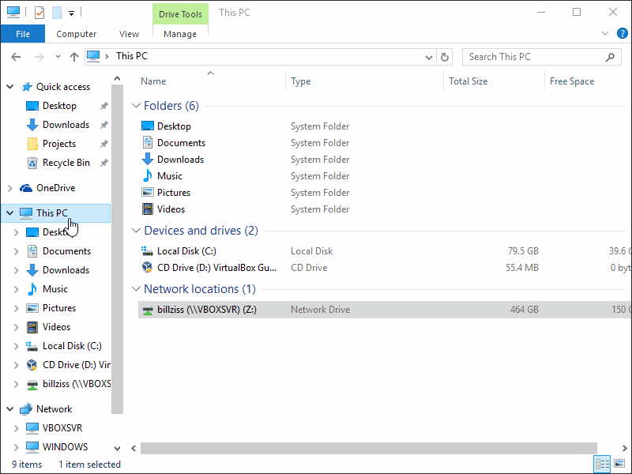
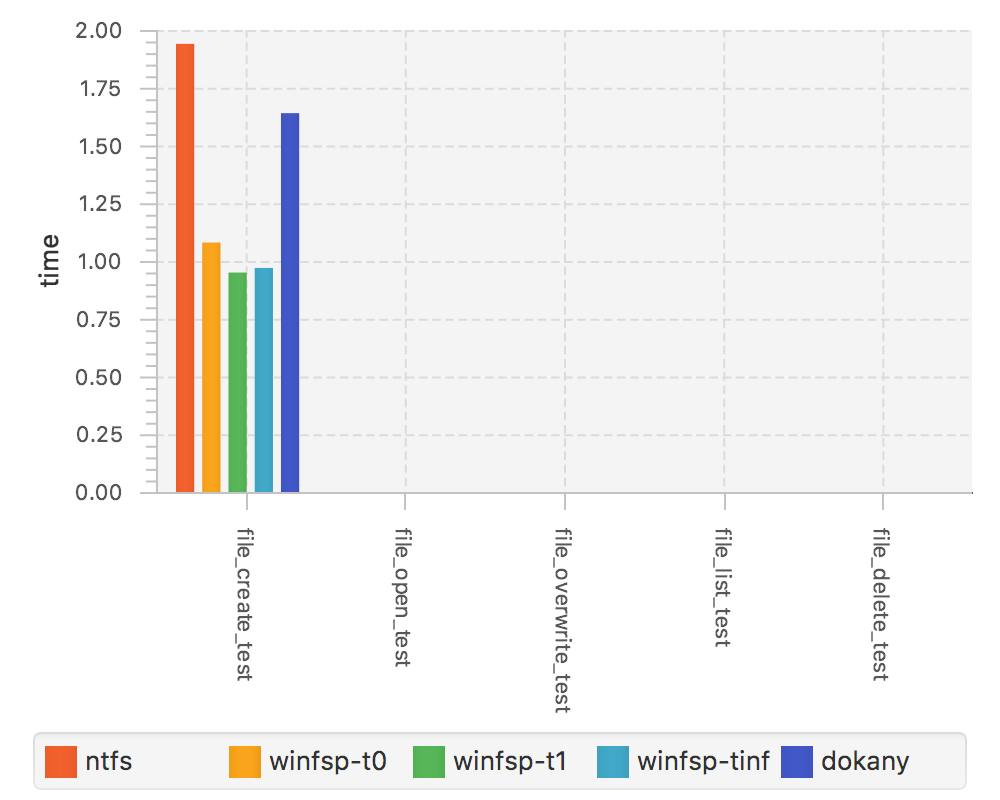
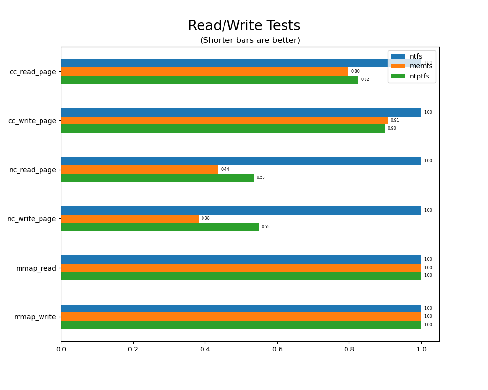

<h1 align="center">
    
    <br/>
    <br/>
    WinFsp &middot; Windows File System Proxy
</h1>

<p align="center">
    <b>Download</b><br>
    <a href="https://github.com/billziss-gh/winfsp/releases/latest">
        
    </a>
    <a href="https://github.com/billziss-gh/winfsp/releases">
        
    </a>
    <a href="https://chocolatey.org/packages/winfsp">
        
    </a>
    <br/>
    <br/>
    <a href="https://ci.appveyor.com/project/billziss-gh/winfsp">
        
    </a>
    <br/>
    <br/>
    WinFsp is a set of software components for Windows computers that allows the creation of user mode file systems. In this sense it is similar to FUSE (Filesystem in Userspace), which provides the same functionality on UNIX-like computers.
    <br/>
    <br/>
    
</p>

## Benefits

### Stability

WinFsp is very stable. There are no known kernel mode crashes and it does not suffer from resource leaks or similar problems. WinFsp owes this stability to its [Design](doc/WinFsp-Design.asciidoc) and its rigorous [Testing Regime](doc/WinFsp-Testing.asciidoc).

### Performance

WinFsp outperforms its competition and in many scenarios performs as well as NTFS. Read more about its [Performance](doc/WinFsp-Performance-Testing.asciidoc).

<p align="center">
    
    
</p>

### Compatibility

WinFsp strives for compatibility with NTFS and file system correctness. For the full details see the [Compatibility](doc/NTFS-Compatibility.asciidoc) document.

### Easy to Use

WinFsp has an easy to use but comprehensive API.

* This simple [Tutorial](doc/WinFsp-Tutorial.asciidoc) explains how to build a file system.
* Consult the [API Reference](http://www.secfs.net/winfsp/apiref/) for native development.
* Includes .NET layer for managed development. See [src/dotnet](src/dotnet).
* Includes FUSE 2.8 compatibility layer: [fuse/fuse.h](inc/fuse/fuse.h)
* Includes FUSE 3.2 compatibility layer: [fuse3/fuse.h](inc/fuse3/fuse.h)

### Other Benefits

* Signed drivers provided on every release.
* Available under the [GPLv3](License.txt) license with a special exception for Free/Libre and Open Source Software.

To learn more about WinFsp, please visit its website: http://www.secfs.net/winfsp/

## Project Organization

The project source code is organized as follows:

* :file_folder: [build/VStudio](build/VStudio): WinFsp solution and project files.
* :file_folder: [doc](doc): The WinFsp design documents and additional documentation can be found here.
* :file_folder: [ext](ext): External dependencies.
    * :file_folder: [ext/tlib](ext/tlib): A small test library originally from the secfs (Secure Cloud File System) project.
    * :file_folder: ext/test: Submodule pointing to the secfs.test project, which contains a number of tools for testing Windows and POSIX file systems.
* :file_folder: [inc](inc): Public headers.
    * :file_folder: [inc/fuse](inc/fuse): Public headers for the FUSE compatibility layer.
    * :file_folder: [inc/fuse3](inc/fuse3): Public headers for the FUSE3 compatibility layer.
    * :file_folder: [inc/winfsp](inc/winfsp): Public headers for the WinFsp API.
* :file_folder: [src](src): WinFsp source code.
    * :file_folder: [src/dll](src/dll): Source code to the WinFsp DLL.
    * :file_folder: [src/dll/fuse](src/dll/fuse): Source code to the FUSE compatibility layer.
    * :file_folder: [src/dll/fuse3](src/dll/fuse3): Source code to the FUSE3 compatibility layer.
    * :file_folder: [src/dotnet](src/dotnet): Source code to the .NET layer.
    * :file_folder: [src/fsptool](src/fsptool): Source code to fsptool command line utility.
    * :file_folder: [src/ku](src/ku): Source code that can be used from kernel or user mode.
    * :file_folder: [src/launcher](src/launcher): Source code to the launcher service and the launchctl utility.
    * :file_folder: [src/sys](src/sys): Source code to the WinFsp FSD.
* :file_folder: [opt/cygfuse](opt/cygfuse): Source code to the FUSE for Cygwin package.
* :file_folder: [tst](tst): Source code to example file systems and test suites.
    * :file_folder: [tst/winfsp-tests](tst/winfsp-tests): WinFsp test suite.
* :file_folder: [tools](tools): Various tools for building and testing WinFsp.

## Building and Running

In order to build WinFsp you will need the following:

* Visual Studio 2015 - 2019
* Windows Driver Kit (WDK) 10
    - **NOTE**: When using the latest WDK (Windows 10.0.18362.1) with Visual Studio 2015 you may get an error about a missing task `ValidateNTTargetVersion`. The fix is to edit the file `\Program Files (x86)\Windows Kits\10\build\WindowsDriver.Common.targets` and modify the `UsingTask` line for `ValidateNTTargetVersion` as follows:
        ```
        <UsingTask TaskName="ValidateNTTargetVersion" AssemblyFile="$(WDKContentRoot)build\bin\Microsoft.DriverKit.Build.Tasks.16.0.dll"/>
        ```
* [Wix toolset](http://wixtoolset.org)

To fully build WinFsp (including the installer) you must use `tools\build.bat`. By default it builds a Release build, but you can choose either the Debug or Release configuration by using the syntax:

    tools\build.bat CONFIGURATION

If you build the driver yourself it will not be signed and Windows will refuse to load it unless you enable "testsigning". You can enable "testsigning" using the command `bcdedit.exe -set testsigning on`. For more information see this [document](doc/WinFsp-Debugging-Setup.asciidoc).

WinFsp is designed to run on Windows 7 and above. It has been tested on the following platforms:

* Windows 7 Enterprise
* Windows 8 Pro
* Windows Server 2012
* Windows 10 Pro
* Windows Server 2016
* Windows 11 Pro

## How to Help

I am looking for help in the following areas:

* If you have a file system that runs on FUSE please consider porting it to WinFsp. WinFsp has a native API, but it also has a FUSE (high-level) API.
* If you are working with a language other than C/C++ (e.g. Delphi, Java, etc.) and you are interested in porting/wrapping WinFsp I would love to hear from you.
* There are a number of outstanding issues listed in the [GitHub repository](https://github.com/billziss-gh/winfsp/issues). Many of these require knowledge of Windows kernel-mode and an understanding of the internals of WinFsp so they are not for the faint of heart.

In all cases I can provide ideas and/or support.

## Where to Discuss

If you wish to discuss WinFsp there are now two options:

- [WinFsp Google Group](https://groups.google.com/forum/#!forum/winfsp)
- [Author's Twitter](https://twitter.com/BZissimopoulos)

## License

WinFsp is available under the [GPLv3](License.txt) license with a special exception for Free/Libre and Open Source Software. A commercial license is also available. Please contact Bill Zissimopoulos \<billziss at navimatics.com> for more details.
